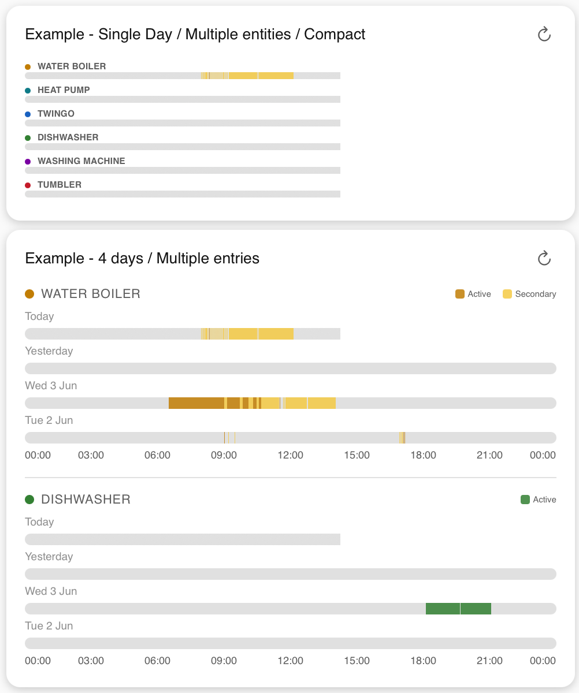
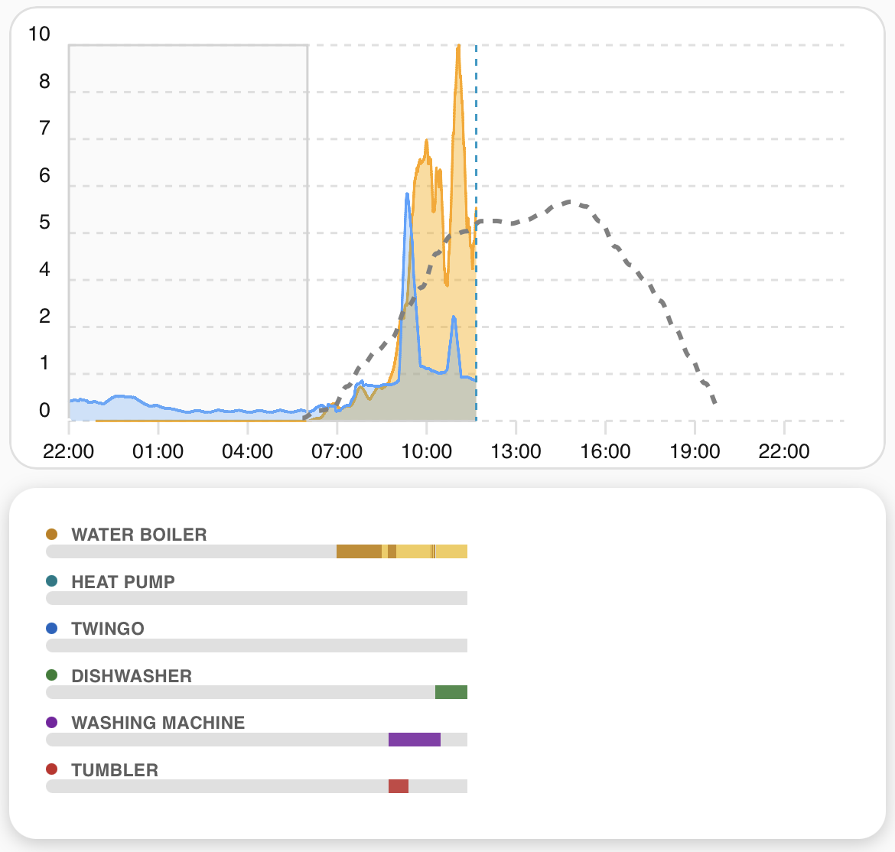

# HA-TimelineBar-Card
A custom Home Assistant card that visualises the state history of one or more binary sensors as coloured timeline bars across a 24-hour window.

Each entity gets its own bar row, filled with colour where the sensor was active and left empty where it was inactive. Multiple days can be shown stacked, and an optional secondary entity can be overlaid on the same bar in a different colour — with the primary entity always taking visual priority on overlap.




---

## Features

- Single or multi-entity display, each with a configurable colour and label
- 1 to 7 days of history, fetched from the HA history API in a single call
- Optional secondary entity overlay per bar, collapsed by default in the UI editor
- Configurable start hour for offset timelines (e.g. matching an apexcharts-card starting at 22:00)
- Compact mode for tight stacking with other cards
- Inline legend aligned with the bar title
- Reverse day order option
- Full UI editor with dynamic entity list, toggle switches, and entity autocomplete
- Compatible with both masonry and sections layouts

---

## Installation

### Manual

1. Download `timeline-bar-card.js` from the [latest release](../../releases/latest)
2. Copy it to `config/www/timeline-bar-card.js`
3. In Home Assistant go to **Settings → Dashboards → Resources**
4. Add a new resource:
   - URL: `/local/timeline-bar-card.js`
   - Type: `JavaScript module`
5. Reload your browser

---

## Usage

### Minimal

```yaml
type: custom:timeline-bar-card
entities:
  - entity: binary_sensor.my_sensor
```

### Multiple entities

```yaml
type: custom:timeline-bar-card
title: Tariff Periods
entities:
  - entity: binary_sensor.dishwasher_running
    name: Dishwasher
    color: "#e07b39"
    legend_label: Running
  - entity: binary_sensor.water_boiler_heating
    name: Water Boiler
    color: "#6c8ebf"
    legend_label: Heating
```

### With secondary entity overlay

```yaml
type: custom:timeline-bar-card
title: Tariff Timeline
entities:
  - entity: binary_sensor.water_boiler_heating
    name: Water Boiler
    color: "#e07b39"
    legend_label: Heating
    secondary_entity: binary_sensor.water_boiler_solar_boost
    secondary_color: "#f5c842"
    secondary_legend_label: Heating (boost mode)
```

### Multi-day with offset start hour

```yaml
type: custom:timeline-bar-card
title: Last 3 Days
days: 3
start_hour: 22
entities:
  - entity: binary_sensor.my_sensor
    name: My Sensor
    color: "#6c8ebf"
```

### Compact mode (for stacking under another card)

```yaml
type: custom:timeline-bar-card
compact: true
show_title: false
entities:
  - entity: binary_sensor.water_boiler_is_heating
    name: Water Boiler
    color: "#C27D00"
  - entity: binary_sensor.heat_pump_running
    name: Heat Pump
    color: "#007A87"
  - entity: binary_sensor.dishwasher_running
    name: Dishwasher
    color: "#2E7D32"
  - entity: binary_sensor.washing_machine_running
    name: Washing Machine
    color: "#7B1FA2"
  - entity: binary_sensor.tumbler_drier_running
    name: Tumbler
    color: "#C62828"
```

---

## Configuration

### Card options

| Option | Type | Default | Description |
|---|---|---|---|
| `entities` | list | **required** | List of entities to display (see below) |
| `title` | string | `"Tariff Timeline"` | Card header title |
| `days` | number | `1` | Number of days to show (1–7) |
| `bar_height` | number | `28` | Height of each bar in pixels (4–80) |
| `start_hour` | number | `0` | Hour the timeline starts at (0–23). Use e.g. `22` to match an apexcharts-card with an offset x-axis |
| `show_title` | boolean | `true` | Show or hide the card title header |
| `show_names` | boolean | `true` | Show or hide entity name labels |
| `show_legend` | boolean | `true` | Show or hide the legend swatches |
| `compact` | boolean | `false` | Compact mode — hides legend, dividers, and tick labels. Disables `show_legend` and `reverse_days` |
| `reverse_days` | boolean | `false` | Show today first, oldest day last |

### Entity options

| Option | Type | Default | Description |
|---|---|---|---|
| `entity` | string | **required** | Entity ID of the binary sensor |
| `name` | string | entity ID | Label shown above the bar |
| `color` | string | auto | Bar colour (any CSS colour value, e.g. `"#e07b39"`) |
| `legend_label` | string | `"Active"` | Label for the primary colour swatch in the legend |
| `secondary_entity` | string | — | Optional second entity overlaid on the same bar |
| `secondary_color` | string | auto | Colour for the secondary entity |
| `secondary_legend_label` | string | `"Secondary"` | Label for the secondary colour swatch in the legend |

---

## UI Editor

The card includes a full UI editor accessible from the Home Assistant dashboard editor. All card-level settings and entity fields can be configured without writing YAML.

The secondary entity section is collapsed by default — click **＋ Add secondary entity** to expand it, and **✕ Remove secondary entity** to clear and collapse it again.

---

## Notes

- History is fetched from the HA [history API](https://developers.home-assistant.io/docs/api/rest/) and refreshed automatically every 5 minutes, or immediately on clicking the ↻ button
- The card uses `hass.callApi()` for authentication — no API tokens required
- For `start_hour > 0`, the timeline window runs from `start_hour` on the previous day to `start_hour` today, matching offset apexcharts-card timelines
- The secondary entity is painted first; the primary entity is painted on top, so primary always wins on any overlapping segments
